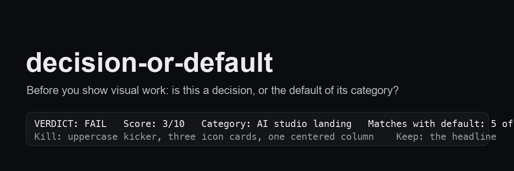

# decision-or-default

A pre-show critic for AI-built visual work. Linters catch contrast and font sizes; they return an empty list on a page a client rates 1 out of 10, because they cannot see that the page is exactly what every model produces for that category. This skill asks the one question they cannot: **is this a decision, or the default?** - and returns a verdict with a score on the client's scale, not the model's.

   

## Install

```bash
git clone https://github.com/MrFreedxm/decision-or-default.git ~/.claude/skills/decision-or-default
```

Then, before showing a landing page, a dashboard, a deck or a first screen: *"run decision-or-default on this"*. The skill also triggers itself when you are about to show or deploy a visual.

## What it does

| the problem | what the skill does |
|---|---|
| the page passed the linter and still looks like "every AI site" | Pass 1: name the category, describe its default from memory, compare line by line; three matches = FAIL before anything else |
| one variant was built and presented as the answer | Pass 1-bis: three constructions per block, the report names what was chosen and why the rest were dropped |
| "it follows the reference" but the reference was remembered, not measured | Pass 1-bis: open the bar and measure its mechanics before building yours |
| the builder grades their own work 7, the client says 3 | the squint test and a table of client remarks mapped to mechanical causes |
| the client "likes it, can't say why" | a `TASTE.md` template: what the client named good, verbatim, with the extracted principle; what they rejected as a stop-list |
| a variant was rejected twice and the third attempt is more effort of the same kind | the two-strikes rule: change the instrument, not the effort |

The verdict is a fixed block: category, the default, matches, the one decision a competitor would not have, then Kill / Fix / Keep with a score. Below 7 the work is not shown.

## How it differs from anti-slop skills

Anti-slop rule sets tell the model what not to generate. This skill runs **after** generation and **before** the show, as a critic calibrated to a specific demanding client through their own recorded taste. It does not replace a design system or a linter; it sits between them and the person who will say "cheap" in three seconds.

## Files

```
SKILL.md            the method: three passes, the remarks table, the verdict format
TASTE.template.md   the client's taste file, filled from their own words
examples/           a real three-round story, anonymized
.claude-plugin/     manifest
```

## Origin

Distilled from months of building pages for one demanding client whose first reaction to a "clean" page was 1/10. Every line in the remarks table is a sentence that was actually said. Built with Claude Code and Codex.

MIT © Ilya Tretyakov
